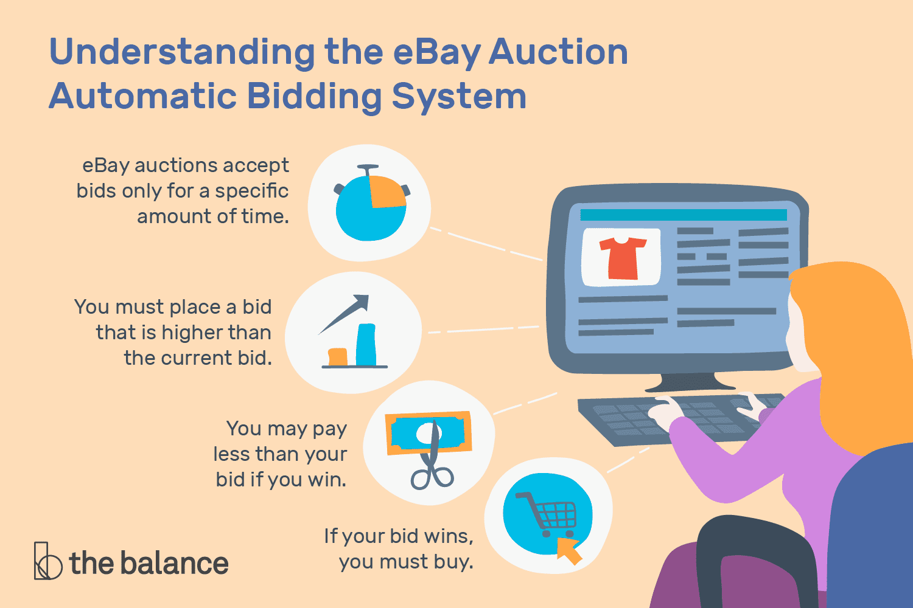

<!--
*** Thanks for checking out this README Template. If you have a suggestion that would
*** make this better, please fork the repo and create a pull request or simply open
*** an issue with the tag "enhancement".
*** Thanks again! Now go create something AMAZING! :D
***
***
***
*** To avoid retyping too much info. Do a search and replace for the following:
*** github_username, repo_name, twitter_handle, email
-->

<!-- PROJECT SHIELDS -->
<!--
*** I'm using markdown "reference style" links for readability.
*** Reference links are enclosed in brackets [ ] instead of parentheses ( ).
*** See the bottom of this document for the declaration of the reference variables
*** for contributors-url, forks-url, etc. This is an optional, concise syntax you may use.
*** https://www.markdownguide.org/basic-syntax/#reference-style-links
-->
[![LinkedIn][linkedin-shield]][linkedin-url]
[![Facebook][facebook-shield]][facebook-url]
[![Twitter][twitter-shield]][twitter-url]
[![Kaggle][kaggle-shield]][kaggle-url]

<!-- TABLE OF CONTENTS -->
## Table of Contents
* [About Me](#about-me)
  * [Developing With](#developing-with)
* [Articles](#articles)
* [License](#license)
* [Contact](#contact)
* [Acknowledgements](#acknowledgements)

<!-- ABOUT -->
## About Me

   
  

  <a href="https://github.com/dgustave/dgustave">
    
    <!--  -->
  </a>

  <h4 align="center">Online Ebay Auction Dataset</h4>
   <h4 align="center"><strong>Buyer/Seller </strong>What could do with this data?</h4>
   

  

    
  This notebook aims to discover whether openbid and auction types make a difference on price, number of bids, bid time and bidder rate when selling different items.

If you have any idea or opinion on the result or code (the following code still has much room for improvement), I'll be glad to hear your comments. :) 
    

     
      
Did you know that <strong>this data set can be found on Kaggle?

    
The datasets contain eBay auction information on Cartier wristwatches, Palm Pilot M515 PDAs, Xbox game consoles, and Swarowski beads.
 
    
auction.csv includes 9 variables:
 
    <li>auctionid: unique identifier of an auction</li> 
    <li>bid: the proxy bid placed by a bidder</li> 
    <li>bidder: eBay username of the bidder</li> 
    <li>bidderrate: eBay feedback rating of the bidder</li> 
    <li>openbid: the opening bid set by the seller</li> 
    <li>price: the closing price that the item sold for (equivalent to the second highest bid + an increment)</li> 
    <li>item: auction item</li> 
    <li>auction_type</li> 
     
  
  <!-- 

  
   <h4 align="center">Portfolio</h4> -->

<!-- MARKDOWN LINKS & ICONS -->
<!-- https://www.markdownguide.org/basic-syntax/#reference-style-links -->
[license-shield]: icons/certified.png 
[license-url]: https://github.com/dgustave/README-Template/blob/master/LICENSE.txt>
[linkedin-url]: https://www.linkedin.com/in/donleygustave/
[linkedin-shield]: reports/icons/linkedin.png
[twitter-url]: https://twitter.com/donley_cg
[twitter-shield]: reports/icons/twitter.png
[facebook-url]: https://www.facebook.com/dgustave
[facebook-shield]: reports/icons/facebook.png
[kaggle-url]: https://www.kaggle.com/donleygustave/ebay-online-auction-notebook
[kaggle-shield]:  reports/icons/kaggle.png

<!-- MARKDOWN LINKS & IMAGES -->
[project-screenshot]: /reports/figures/bid_items.png

### Developing With

  |          |      |   
  | ---------------------------------------- | ---------------------------------------- | --------------------------------------| 
  |                                          |                                          |                                       |
        

<!-- LICENSE -->
## License
Distributed under the MIT License. See `LICENSE` for more information.

<!-- CONTACT -->
## Contact
Donley Gustave - [@donley_cg](https://twitter.com/donley_cg) - donleyc.gustave@gmail.com

<!-- ACKNOWLEDGEMENTS -->
## Acknowledgements
<li> The data set I came from this users Kaggle page https://www.kaggle.com/onlineauctions/online-auctions-dataset. </li>

Project Organization
------------

    ├── LICENSE
    ├── Makefile           <- Makefile with commands like `make data` or `make train`
    ├── README.md          <- The top-level README for developers using this project.
    ├── data
    │   ├── external       <- Data from third party sources.
    │   ├── interim        <- Intermediate data that has been transformed.
    │   ├── processed      <- The final, canonical data sets for modeling.
    │   └── raw            <- The original, immutable data dump.
    │
    │
    ├── notebooks          <- Jupyter notebooks. Naming convention is a number (for ordering),
    │                         the creator's initials, and a short `-` delimited description, e.g.
    │                         `1.0-jqp-initial-data-exploration`.
    │
    ├── references         <- Data dictionaries, manuals, and all other explanatory materials.
    │
    ├── reports            <- Generated analysis as HTML, PDF, LaTeX, etc.
    │   └── figures        <- Generated graphics and figures to be used in reporting
    │
    ├── requirements.txt   <- The requirements file for reproducing the analysis environment, e.g.
    │                         generated with `pip freeze > requirements.txt`
    │
    ├── setup.py           <- makes project pip installable (pip install -e .) so src can be imported
    │
    └── tox.ini            <- tox file with settings for running tox; see tox.readthedocs.io

--------

<small>Project based on the <a target="_blank" href="https://drivendata.github.io/cookiecutter-data-science/">cookiecutter data science project template</a>. #cookiecutterdatascience</small>

<!-- Footer -->
<footer id="footer">

Copyright &copy; 2020 Gustave LLC
 Designed by <a rel="nofollow" href="https://www.facebook.com/dgustave">Donley Gustave</a>

</footer>

ebay-auction
==============================

Ebay Auction data set visualizations and data manipulations. 
